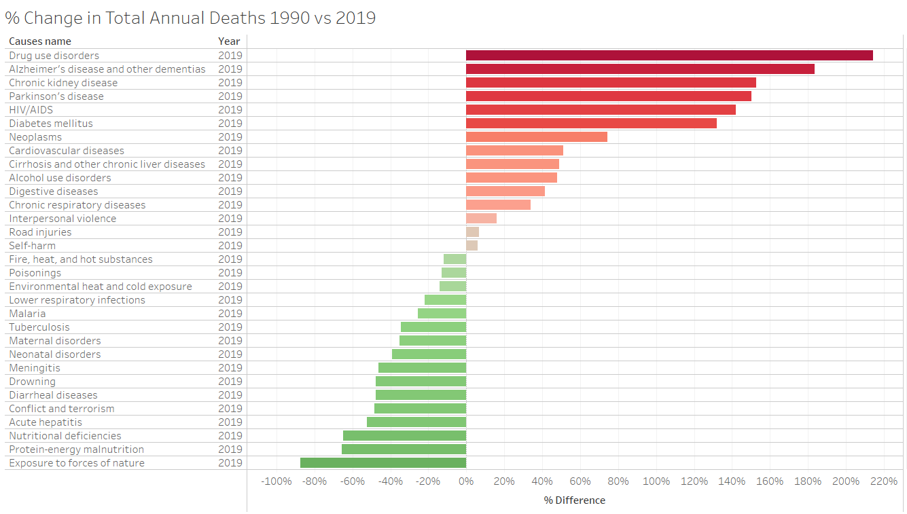

# Final-Project-Tableau

## Project/Goals
I wanted to figure out the trends in global and country deaths over the last 20 years that are decreasing and increasing.   I plan to tell a data story which shows what ways civilations are improving in regards to human longevity and which ways it is getting worse.

## Process

1. I went through the data set and experimented with different figures to understand the data. Then I chose the story I want to tell with the data.
2. I calculated the percent change in total death numbers per cause between 1990 and 2019.
3. I created a Tableau dashboard that showed my data and conveyed a data story.

## Results

I chose the option 2 death statistic data for my project. The data included the main casuses of death that took place in countries around the world from 1990 to 2019.

 The data set had the following 6 columns of data:
| Column Data | Datatype |
| --- | --- |
Death cause name  | String
Death cause full description | String
Death number | Number (whole)
Entity (country where death took place) | String & Geographic Country Data
Code | String
Year | Number (whole)

To understand the data I made lots of figures in Tableau.  I started off creating a table that allowed me to see the different data in the data set.

I created a world map to see how the total deaths are distributed by country.  The color scale is red for most deaths, yellow for least.  

The most visually useful graph I created was the area chart.   The chart showed the significance of the death numbers by death cause with the area under the curve, while the curve showed how the trend changed by year. I analyzed all the death causes together in one chart as well as individually.   The snips below show total global deaths, but I also filtered by individual country to see that data.

I used a line graph to look at historical data and also forecast the trend into the future.   With this graph I filtered for death cause and country. 

I ran cluster analysis for death cause, year and country with death numbers as the measured value. I let Tableau automatically define the number of clusters per variable. The cluster analysis wasn't very interesting for this data set as there was only one numerical value and the rest were categorical.  

After understanding the data I decided I want to figure out which causes of death were increasing and which were decreasing betwwen the start of the data set and the end of the data set.

To calculate this I created a table with death casue name and year as rows and the sum of death number as the measured values.  I excluded the year data from 1991-2018 and calculated the % difference in the quick calcuation setting.  The table can be seen below.

The % difference was calculating the information I wanted, but it was also calculating the difference in death numbers from different categories in 1990 from the row above in 2019.  To solve this issue I hid the values from 1990. 

Finally I represented the % difference in death numbers by a bar chart, with a red - green color scheme for negative and positive changes respectively.

My final dashboard featured the percent change in total annual deaths between 1990 and 2019, a line graph for the historical data and forecast and world map.   The world map allows you to filter data for the line graph and the % change in annual deaths by country.  The line graph has a drop down menu so you can look at the historical data for every casue of death as well as a 5 year forecast of what may happen in terms of death numbers.

## Challenges 
The main challenge of the project was getting proficient with Tableau's interface and learning the extent of it's functionality.   After a full weekend of tinkering in Tableau use I understood my dataset and the strength of Tableau as a data visualization tool.

## Future Goals
The next step for the project would be to extend the analysis to compare the death rates of different countries in a meaningful way.
